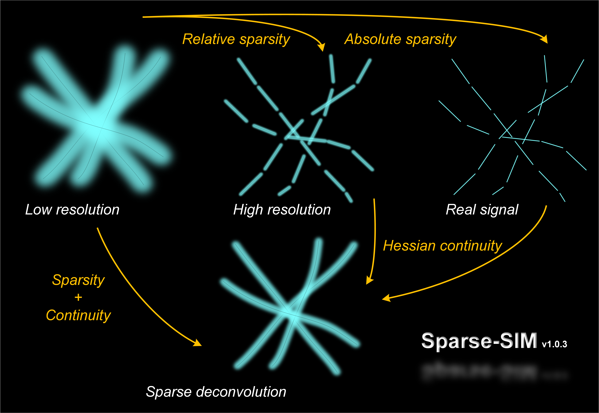
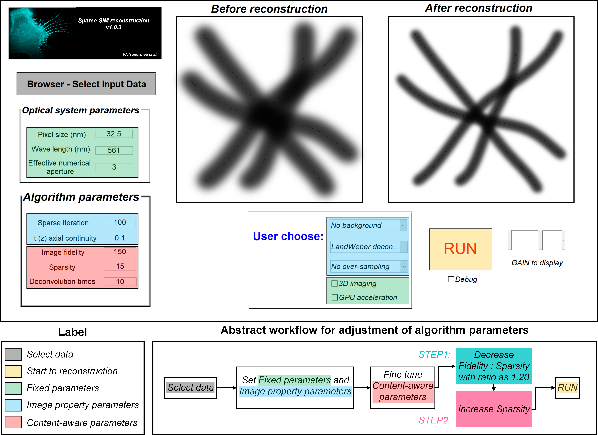
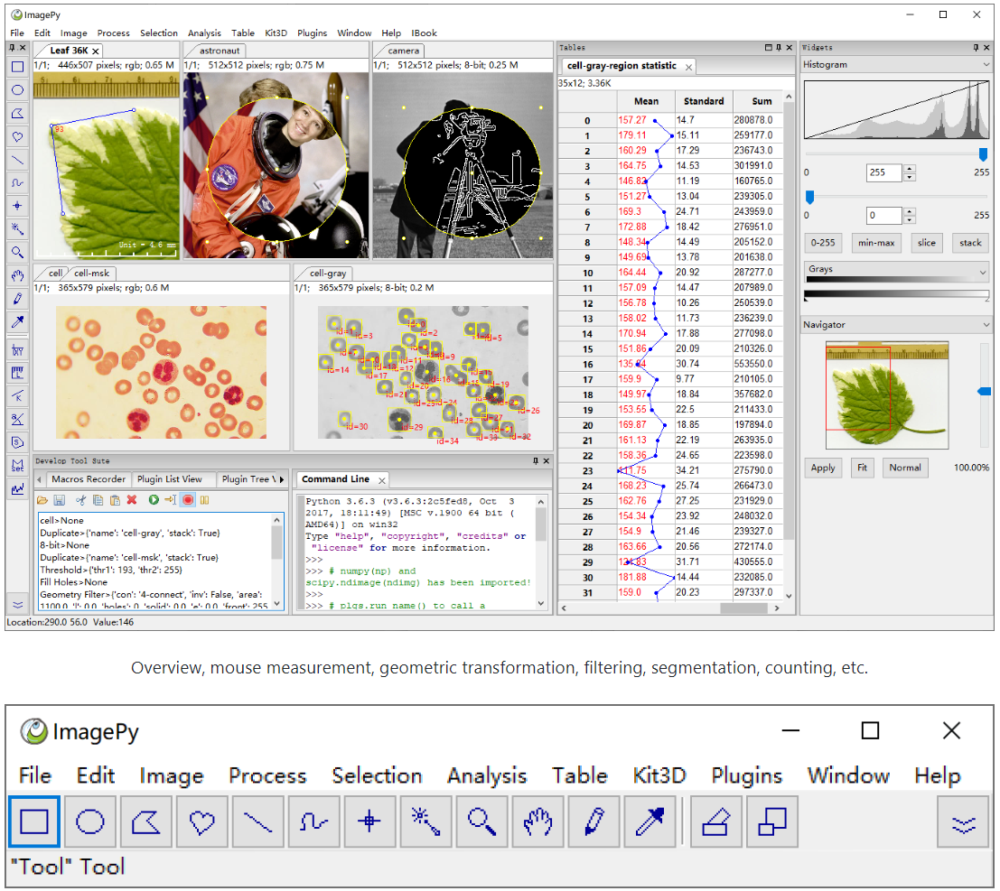

## About Me
- I’m currently a Ph.D. student at Harbin Institute of Technology (HIT).
- I'm buliding advanced microscopy for cell/neuro biology.
- I'm also developing algorithms for low/high level computer-vision tasks.
- Interested in machine learning and imaging.
#### Scripting:

## Contact me 📱

1. **Blogs**: [CSDN](https://blog.csdn.net/weixin_41923961/)
2. **Website**: [https://weisongzhao.github.io/](https://weisongzhao.github.io/)
3. **Email**: zhaoweisong950713@163.com
4. **Twitter**: [@weisong_zhao](https://twitter.com/weisong_zhao)

## News (start from 2020)

- 2021-03 An OPEN scientific discussion about deconvolution/sparse-deconvolution is posted on [GitHub](https://weisongzhao.github.io/rl_positivity_sim/) as well as on [Twitter](https://twitter.com/weisong_zhao/status/1370308101690118146);
- 2020-11: [Sparse-SIM](https://github.com/WeisongZhao/Sparse-SIM) is fully open-source!
- 2020-01: [img2vid](https://github.com/WeisongZhao/img2vid) v0.1.0 released.
- 2020-01: [Adaptive filter imagej-plugin](https://github.com/WeisongZhao/AdaptiveMedian.imagej) v0.1.0 released.
- 2020-01: [Sparse-SIM](https://github.com/WeisongZhao/Sparse-SIM) v1.0.3 released `.p` code.

## Selected Projects

#### 8. [PANEL](https://github.com/WeisongZhao/PANEL):(written in Matlab, Python:snake: and java).

#### 7. [DL-SIM](https://github.com/WeisongZhao/DL-SIM):(written in Python:snake: and java).

#### 6. [SACD](https://github.com/WeisongZhao/SACD): 10~20 times faster super-resolution fluctuation imaging. (written in Matlab, Python:snake: and java).

<b>Details for SACD</b>

<b>Concept:</b>

#### 5. [Sparse-SIM](https://github.com/WeisongZhao/Sparse-SIM): An universal post-processing framework for fluorescent microscopy (written in Matlab).

<b>Details for Sparse-SIM</b>

<b>Concept:</b>
 

<b>Algorithm UI:</b>

#### 4. [img2vid](https://github.com/WeisongZhao/img2vid): A light weight framework for making exsiting images to videos (written in Matlab).

<b>Example video produced by img2vid</b>

#### 3. [ImagePy](https://github.com/Image-Py/imagepy): An open source image processing framework (written in Python:snake:).

<b>A glance to ImagePy</b>

#### 2. [Adaptive median filter](https://github.com/WeisongZhao/AdaptiveMedian.imagej): (written in java). 

#### 1. [AdaptiveOptics.simulation](https://github.com/WeisongZhao/AdaptiveOptics.simulation): a light weight simulation framework for adaptive optics in microscopy (written in Matlab).

#### 0. [Clean-Web-Template](https://github.com/WeisongZhao/CleanWebTemplate): a light weight personal website template (written in html/Javascript).

<!--
## Software list:

||FIJI/ImageJ plugin|Matlab framework|Python framework|Other utils|
|---|----|----|----|----|
|icon|

|

|

|

|
|1|[PANELJ](https://github.com/WeisongZhao/PANELJ) (private)|[PANELM](https://github.com/WeisongZhao/PANELM) (private)|[ImagePy](https://github.com/Image-Py/imagepy)|[CleanWebTemplate](https://github.com/WeisongZhao/CleanWebTemplate)|
|2|[SACDj](https://github.com/WeisongZhao/SACDj) (private)|[SACDM](https://github.com/WeisongZhao/SACDM) (private)|[DL-SIM](https://github.com/WeisongZhao/DL-SIM) (private)| |
|3|[Adaptive median filter](https://github.com/WeisongZhao/AdaptiveMedian.imagej)|[img2vid](https://github.com/WeisongZhao/img2vid)|img2vidPy (in progress)| |
|4|[POFI](https://github.com/WeisongZhao/POFI.imagej) (private)|[Bayes-LFM](https://github.com/WeisongZhao/Bayes-LFM) (private)|PANELPy (in progress)| |
|5|SparseJ (in progress)|[Sparse-SIM](https://github.com/WeisongZhao/Sparse-SIM)|SparsePy (in progress)| |
|6|img2vidJ (in progress)|[Palette](https://github.com/WeisongZhao/Palette.ui)|LFMpy (in progress)| |
|6| |[AdaptiveOptics.simulation](https://github.com/WeisongZhao/AdaptiveOptics.simulation)| | |
|7| |[MNIST_Recognization](https://github.com/WeisongZhao/MNIST_Recognization)| | |
-->

<!--
**WeisongZhao/WeisongZhao** is a ✨ _special_ ✨ repository because its `README.md` (this file) appears on your GitHub profile.

Here are some ideas to get you started:

- 🔭 I’m currently working on ...
- 🌱 I’m currently learning ...
- 👯 I’m looking to collaborate on ...
- 🤔 I’m looking for help with ...
- 💬 Ask me about ...
- 📫 How to reach me: ...
- 😄 Pronouns: ...
- ⚡ Fun fact: ...

#### ImageJ plugin
[Adaptive median filter](https://github.com/WeisongZhao/AdaptiveMedian.imagej); [PANELJ](https://github.com/WeisongZhao/PANELJ); [SACDj](https://github.com/WeisongZhao/SACDj); 

#### Matlab framework
[Sparse-SIM](https://github.com/WeisongZhao/Sparse-SIM); [Bayes-LFM](https://github.com/WeisongZhao/Bayes-LFM); [img2vid](https://github.com/WeisongZhao/img2vid); [SACDM](https://github.com/WeisongZhao/SACDM); [PANELM](https://github.com/WeisongZhao/PANELM); 

[AdaptiveOptics.simulation](https://github.com/WeisongZhao/AdaptiveOptics.simulation); [MNIST_Recognization](https://github.com/WeisongZhao/MNIST_Recognization)

#### Python framework
[ImagePy](https://github.com/Image-Py/imagepy); [DL-SIM](https://github.com/WeisongZhao/DL-SIM); 

#### Other utils

[CleanWebTemplate](https://github.com/WeisongZhao/CleanWebTemplate);

-->
