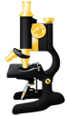

## About Me
- Professor, PI, microscopist, and data scientist at Harbin Institute of Technology (HIT).
- His research interest focuses on biomedical imaging, machine learning, and bioimage analysis. 
- His lab is building advanced optical microscopy for biomedical applications, as well as developing smart algorithms across modalities including optical microscopy, acoustic/photoacoustic imaging, and cryo-EM/ET.

#### Scripting:

## Contact me 📱

1. **Website**: [https://weisongzhao.github.io/MyWeb2/](https://weisongzhao.github.io/)
2. **Email**: zhaoweisong950713@163.com
3. **Twitter**: [@weisong_zhao](https://twitter.com/weisong_zhao)
4. **Blogs**: [CSDN](https://blog.csdn.net/weixin_41923961/)

## News (start from 2020)

- 2024-01: [SN2N](https://github.com/WeisongZhao/SN2N) is fully open-source;
- 2022-10: [PANELpy](https://github.com/WeisongZhao/PANELpy) is fully open-source;
- 2022-05: [SACDm](https://github.com/WeisongZhao/SACDm) and [SACDj](https://github.com/WeisongZhao/SACDj) are fully open-source;
- 2021-11: A Python version with GPU accelartion of the <i>Sparse deconvolution</i> is released at [sparse-deconv-py](https://github.com/WeisongZhao/sparse-deconv-py);
- 2021-11: I post a 'behind the paper' blog  about the <i>Sparse deconvolution</i> at [Nature Research Community](https://bioengineeringcommunity.nature.com/posts/physical-resolution-might-be-meaningless-if-in-the-mathmetical-space);
- 2021-07: [PANELM](https://github.com/WeisongZhao/PANELM) and [PANELJ](https://github.com/WeisongZhao/PANELJ) are fully open-source;
- 2021-03: An OPEN scientific discussion about deconvolution/sparse-deconvolution is posted on [GitHub](https://weisongzhao.github.io/rl_positivity_sim/) as well as on [Twitter](https://twitter.com/weisong_zhao/status/1370308101690118146);
- 2020-11: [Sparse-SIM](https://github.com/WeisongZhao/Sparse-SIM) is fully open-source!
- 2020-01: [img2vid](https://github.com/WeisongZhao/img2vid) v0.1.0 released.
- 2020-01: [Adaptive filter imagej-plugin](https://github.com/WeisongZhao/AdaptiveMedian.imagej) v0.1.0 released.
- 2020-01: [Sparse-SIM](https://github.com/WeisongZhao/Sparse-SIM) v1.0.3 released `.p` code.

## Selected Projects

| **Name** | **MATLAB** | **Java (ImageJ)** | **Python** | **Other languages** | **Reference** | **Description** |
| :----: | :----: |:----: | :----: | :----: | :----: | :----: |
|**SN2N**| - |-|[SN2N](https://github.com/WeisongZhao/SN2N)|-|[bioRxiv](https://doi.org/10.1101/2024.01.23.576521)|Self-inspired Noise2Noise learning to denoise engine|
|**rFRC & PANEL**| [PANELM](https://github.com/WeisongZhao/PANELM)|[PANELJ](https://github.com/WeisongZhao/PANELJ)|[PANELpy](https://github.com/WeisongZhao/PANELpy)|-|[Light: Sci. Appl.](https://doi.org/10.1038/s41377-023-01321-0)|Quantitatively mapping the local image quality at super-resolution scale|
|**SACD**| [SACDm](https://github.com/WeisongZhao/SACDm)|[SACDj](https://github.com/WeisongZhao/SACDj)|-|-|[Nat. Photon.](https://doi.org/10.1038/s41566-023-01234-9)| 100 times faster super-resolution fluctuation imaging.|
|**Sparse deconvolution**| [Sparse-SIM](https://github.com/WeisongZhao/Sparse-SIM)|-|[sparse-deconv-py](https://github.com/WeisongZhao/sparse-deconv-py)|-| [Nat. Biotech.](https://doi.org/10.1038/s41587-021-01092-2)| An universal post-processing framework for fluorescence microscopy.|
|**ImagePy**|-|-|[ImagePy](https://github.com/Image-Py/imagepy)|-| [Bioinformatics](https://doi.org/10.1093/bioinformatics/bty313)|An open source image processing framework (A Pythonic ImageJ).|
|**Simulation for Adaptive Optics**|[Adaptive-Optics-simulation](https://github.com/WeisongZhao/AdaptiveOptics.simulation)|-|-|-| [Rev. Sci. Instrum.](https://aip.scitation.org/doi/abs/10.1063/1.5088102)|A light weight simulation framework for adaptive optics in microscopy.|
|img2vid| [img2vid](https://github.com/WeisongZhao/img2vid)|-|-|-| [Nat. Biotech.](https://doi.org/10.1038/s41587-021-01092-2)| A light weight framework for making exsiting images to videos.|
|Palette.ui| [Palette.ui](https://github.com/WeisongZhao/Palette.ui)|-|-|-| [Nat. Biotech.](https://doi.org/10.1038/s41587-021-01092-2)|Multi-color imaging tool to merge/composite frames.|
|Adaptive median filter|-|[Adaptive-Median-imagej](https://github.com/WeisongZhao/AdaptiveMedian.imagej)|-|-| [Nat. Biotech.](https://doi.org/10.1038/s41587-021-01092-2)|A median filter with adaptive threshold to avoid blurring effects.|
|t-varianceJ|-|[t-varianceJ](https://github.com/WeisongZhao/t-varianceJ)|-|-|-|T-axial variance calculation will highlight the regions that have calcium signal transients.|
|Clean Web Template|-|-|-|[CleanWeb-Template](https://github.com/WeisongZhao/CleanWebTemplate) (html/Javascript)|-|A light weight personal website template.|

<!--
## Software list:

||FIJI/ImageJ plugin|Matlab framework|Python framework|Other utils|
|---|----|----|----|----|
|icon|

|

|

|

|
|1|[PANELJ](https://github.com/WeisongZhao/PANELJ) (private)|[PANELM](https://github.com/WeisongZhao/PANELM) (private)|[ImagePy](https://github.com/Image-Py/imagepy)|[CleanWebTemplate](https://github.com/WeisongZhao/CleanWebTemplate)|
|2|[SACDj](https://github.com/WeisongZhao/SACDj) (private)|[SACDM](https://github.com/WeisongZhao/SACDM) (private)|[DL-SIM](https://github.com/WeisongZhao/DL-SIM) (private)| |
|3|[Adaptive median filter](https://github.com/WeisongZhao/AdaptiveMedian.imagej)|[img2vid](https://github.com/WeisongZhao/img2vid)|img2vidPy (in progress)| |
|4|[POFI](https://github.com/WeisongZhao/POFI.imagej) (private)|[Bayes-LFM](https://github.com/WeisongZhao/Bayes-LFM) (private)|PANELPy (in progress)| |
|5|SparseJ (in progress)|[Sparse-SIM](https://github.com/WeisongZhao/Sparse-SIM)|SparsePy (in progress)| |
|6|img2vidJ (in progress)|[Palette](https://github.com/WeisongZhao/Palette.ui)|LFMpy (in progress)| |
|6| |[AdaptiveOptics.simulation](https://github.com/WeisongZhao/AdaptiveOptics.simulation)| | |
|7| |[MNIST_Recognization](https://github.com/WeisongZhao/MNIST_Recognization)| | |
-->

<!--
**WeisongZhao/WeisongZhao** is a ✨ _special_ ✨ repository because its `README.md` (this file) appears on your GitHub profile.

Here are some ideas to get you started:

- 🔭 I’m currently working on ...
- 🌱 I’m currently learning ...
- 👯 I’m looking to collaborate on ...
- 🤔 I’m looking for help with ...
- 💬 Ask me about ...
- 📫 How to reach me: ...
- 😄 Pronouns: ...
- ⚡ Fun fact: ...

#### ImageJ plugin
[Adaptive median filter](https://github.com/WeisongZhao/AdaptiveMedian.imagej); [PANELJ](https://github.com/WeisongZhao/PANELJ); [SACDj](https://github.com/WeisongZhao/SACDj); 

#### Matlab framework
[Sparse-SIM](https://github.com/WeisongZhao/Sparse-SIM); [Bayes-LFM](https://github.com/WeisongZhao/Bayes-LFM); [img2vid](https://github.com/WeisongZhao/img2vid); [SACDM](https://github.com/WeisongZhao/SACDM); [PANELM](https://github.com/WeisongZhao/PANELM); 

[AdaptiveOptics.simulation](https://github.com/WeisongZhao/AdaptiveOptics.simulation); [MNIST_Recognization](https://github.com/WeisongZhao/MNIST_Recognization)

#### Python framework
[ImagePy](https://github.com/Image-Py/imagepy); [DL-SIM](https://github.com/WeisongZhao/DL-SIM); 

#### Other utils

[CleanWebTemplate](https://github.com/WeisongZhao/CleanWebTemplate);

-->
